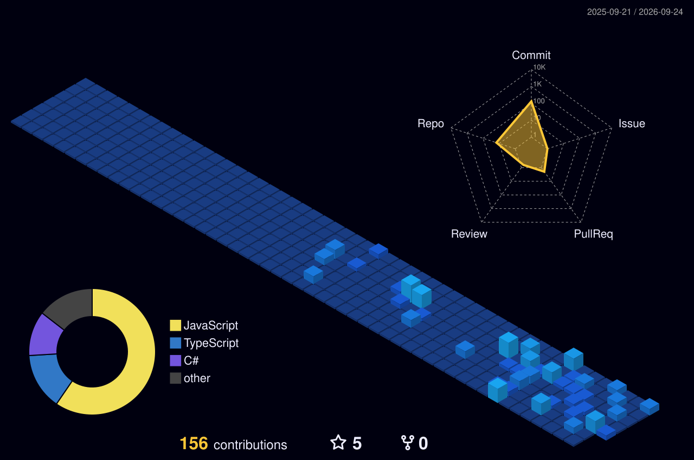

<div align="center">


<br />

<a href="https://www.linkedin.com/in/danish-waheed-3995aa296">
  
</a>
<a href="mailto:danishwaheed271@gmail.com">
  
</a>


</div>


## `01` &nbsp;Presentation Layer

```csharp
namespace DanishWaheed.Profile;

public sealed record Developer
{
    public string Name      => "Danish Waheed";
    public string Role      => "Full Stack Developer";
    public string Location  => "Pakistan";
    public string Education => "BS Computer Science";

    public string[] Backend  => ["C#", "ASP.NET Core 8/9", "SQL Server"];
    public string[] Frontend => ["React", "JavaScript ES6+", "Bootstrap"];
    public string[] Exploring => ["Agentic AI", "LLM Integration", "Azure"];

    public string Motto => "Coding with structure, building with purpose.";
}
```

<details>
<summary><b>What I actually like talking about</b> &nbsp;<i>(click to expand)</i></summary>

<br />

> **Building robust APIs with ASP.NET Core.** Clean controllers, sensible DTOs, middleware that does one thing well, and a data layer that does not leak into everything else.

> **State management and component architecture in React.** Where state should live, when a component is doing too much, and how to keep a UI predictable as it grows.

> **The future of Agentic AI and LLM integration.** Wiring models into real products where they have to be reliable, not just impressive in a demo.

</details>


## `02` &nbsp;Application Layer

<div align="center">

**Backend and data**


**Frontend and design**


**Tools and platform**


</div>

<details>
<summary><b>Academic foundation</b></summary>

<br />

| Area | Where it shows up in my work |
|:--|:--|
| Programming in C# and C++ | Memory model intuition, async patterns, and writing code that stays readable at scale |
| Calculus | Understanding rates of change behind performance profiling and growth curves |
| Statistics and Probability | Reading metrics honestly, sampling, and reasoning about model outputs |
| UI/UX and Graphic Design | Interfaces that a user can navigate without a manual |

</details>


## `03` &nbsp;Data Layer

<div align="center">


<br /><br />


<br /><br />


</div>

### Contributions in 3D

<div align="center">



</div>

### The snake eats the graph

<div align="center">

<picture>
  <source media="(prefers-color-scheme: dark)" srcset="https://raw.githubusercontent.com/dw-dash-codes/dw-dash-codes/output/snake.svg" />
  <source media="(prefers-color-scheme: light)" srcset="https://raw.githubusercontent.com/dw-dash-codes/dw-dash-codes/output/snake-light.svg" />
  
</picture>

<br /><br />


</div>


## `04` &nbsp;Endpoints

<div align="center">

| Method | Route | Response |
|:--|:--|:--|
| `GET` | **Email** | [danishwaheed271@gmail.com](mailto:danishwaheed271@gmail.com) |
| `GET` | **LinkedIn** | [danish-waheed-3995aa296](https://www.linkedin.com/in/danish-waheed-3995aa296) |
| `GET` | **Location** | Pakistan |
| `POST` | **Collaboration** | Open. Send a message and I will reply. |

<br />

<i>Coding with structure, building with purpose.</i>

</div>


